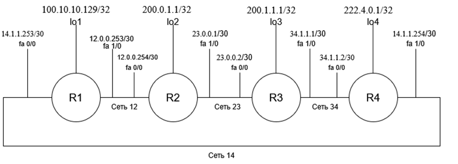

#  Подробное руководство по выполнению лабораторной работы по сетям


## **ШАГ 0: Установка и настройка эмулятора**

### 0.1 Скачивание и установка

* Скачайте архив по ссылке [тык](https://elearning.volgatech.net/mod/url/view.php?id=1441280) 
* Извлеките всё содержимое архива в отдельную папку
* Запустите файл WinPcap_4_1_3.exe из извлечённой папки

### 0.2 Замена батников

 * Скачайте второй архив по ссылке: [тык](https://elearning.volgatech.net/mod/url/view.php?id=1441604)

* Извлеките батники из второго архива

* Замените существующие батники в папке извлеченных файлоа первого архива на новые из второго архива

---

## **ШАГ 1: ПОДГОТОВКА И АНАЛИЗ ВАРИАНТА**

### **1.1 Получить вариант**

**Где найти свой вариант?**
Ваш вариант можно найти в таблице рядом с вашей фамилией[тык](https://elearning.volgatech.net/mod/url/view.php?id=1441044)

Вариант выглядит как **AXXXXXXX** (например, у меня A121111151). Каждая цифра в варианте соответствует таблице из PDF-файла "Супервариант_А.pdf"([тык](https://elearning.volgatech.net/pluginfile.php/2571705/mod_assign/introattachment/0/%D0%A1%D1%83%D0%BF%D0%B5%D1%80%D0%B2%D0%B0%D1%80%D0%B8%D0%B0%D0%BD%D1%82_A.pdf?forcedownload=1))

| Позиция   | Таблица | Что определяет                                                                                                                  |
| --------- | ------- | ------------------------------------------------------------------------------------------------------------------------------- |
| 1-я цифра | 1       | Маршрутизатор администратора(Особого значения не имеет, нужно всего лишь с этого маршрутизатора начать запуск и настройку сети) |
| 2-я цифра | 2       | Номера петлевых интерфейсов                                                                                                     |
| 3-я цифра | 3       | Выбор IP-адреса для петель                                                                                                      |
| 4-я цифра | 4       | Маски для петлевых интерфейсов                                                                                                  |
| 5-я цифра | 5       | Выбор сети для петель                                                                                                           |
| 6-я цифра | 6       | Диапазоны адресов для петель                                                                                                    |
| 7-я цифра | 7       | Маски для сетей межсоединений                                                                                                   |
| 8-я цифра | 8       | Выбор сети для межсоединений                                                                                                    |
| 9-я цифра | 9       | Диапазоны адресов для межсоединений                                                                                             |

### **1.2 Анализ варианта на примере**
## **ШАГ 1: ПОДГОТОВКА И АНАЛИЗ ВАРИАНТА**

### **1.1 Получить и расшифровать вариант**

**Где найти свой вариант?**
Ваш вариант можно найти в таблице рядом с вашей фамилией:  
[Ссылка на таблицу с вариантами](https://example.com/варианты) ← *замените на реальную ссылку*

**Где найти таблицы для расшифровки?**  
Все таблицы находятся в PDF-файле: **"Супервариант.pdf"**  
[Ссылка на файл с таблицами](https://example.com/супервариант) ← *замените на реальную ссылку*

**Ваш вариант:** **A121111151**

### **1.2 Анализ варианта A121111151 на примере**

Разбиваем вариант на цифры: **1 2 1 1 1 1 1 5 1**

**Подробная расшифровка каждой цифры:**

| Позиция | Цифра | Таблица   | Значение                                                             | Что это означает на практике                                                                                                       |
| ------- | ----- | --------- | -------------------------------------------------------------------- | ---------------------------------------------------------------------------------------------------------------------------------- |
| **1-я** | 1     | Таблица 1 | **Администратор на r1**                                              | Начинаем настройку с маршрутизатора R1, он будет главным                                                                           |
| **2-я** | 2     | Таблица 2 | **r1=1, r2=2, r3=3, r4=4**                                           | Петлевые интерфейсы: Loopback1, Loopback2, Loopback3, Loopback4(Если у вас все r=2, то Loopback2, Loopback2, Loopback2, Loopback2) |
| **3-я** | 1     | Таблица 3 | **r1=первый, r2=первый, r3=первый, r4=первый**                       | В каждой сети берем самый первый доступный адрес для хостов                                                                        |
| **4-я** | 1     | Таблица 4 | **r1=/32, r2=/32, r3=/32, r4=/32**                                   | Петлевые интерфейсы будут отдельными хостами (как /32)                                                                             |
| **5-я** | 1     | Таблица 5 | **r1=любая допустимая, r2=первая, r3=первая, r4=первая**             | Из диапазонов выбираем самые первые подходящие сети, только у первой можно выбрать любую                                           |
| **6-я** | 1     | Таблица 6 | **r1=100.10.10.128/25, r2=200.0.1/24, r3=200.1.1/25, r4=222.4.0.0/** | Петли: R1=100.10.10.128/25, R2=200.0.1/24, R3=200.1.1/25(200.1.1.1/25 после консультации с Бородиным), R4=222.4.0.0/16             |
| **7-я** | 1     | Таблица 7 | **r1=/30, r2=/30, r3=/30, r4=/30**                                   | Сети между маршрутизаторами будут маленькие (по 4 адреса)                                                                          |
| **8-я** | 5     | Таблица 8 | **последняя-первая-первая-последняя**                                | Сеть12=последняя доступная сеть, Сеть23=первая д.с., Сеть34=первая д.с., Сеть14=последняя д.с.                                     |
| **9-я** | 1     | Таблица 9 | **12=12.0.0.128/25, 23=23.0.0.0/24, 34=34.1.1.0/25, 14=14.1.1.0/24** | Сети: 12=12.0.0.128/25, 23=23.0.0.0/24, 34=34.1.1.0/25, 14=14.1.1.0/24                                                             |


 Внимание!
В 6 таблице у сети r3 адрес неполный. Такое может случиться часто, некоторые данные могут быть неполные, поэтому обязательно подходите к преподавателю, чтобы решить этот вопрос

---

## **ШАГ 2: СОЗДАНИЕ АДРЕСНОГО ПЛАНА**
* при выполнении этого шага пригодится эта шпаргалка [тык](https://elearning.volgatech.net/mod/resource/view.php?id=1441323)
### **2.1 Расчет петлевых интерфейсов**

**Для каждого маршрутизатора (r1, r2, r3, r4):**

1. **Определить номер петли** из Таблицы 2
2. **Определить диапазон** из Таблицы 6
3. **Определить маску** из Таблицы 4
4. **Выбрать сеть** по правилу из Таблицы 5
5. **Выбрать адрес** в сети по правилу из Таблицы 3

**Пример для r1 (вариант A121111151):**

**Исходные данные:**
- Таблица 2: r1 = 1 → `loopback 1`(это всего лишь название интрефейса, получена путем "loopback" + номер петлевого интерфейса из таб. 2)
- Таблица 6: r1 = 100.10.10.128/25
- Таблица 4: r1 = /32 (блок по 1 адресу), маска 255.255.255.255
- Таблица 5: r1 = любой допустимый 
- Таблица 3: r1 = первый адрес

**Расчет:**
**Диапазон:** 100.10.10.128/25 (адреса 128-255)

**При маске /32 каждая "сеть" - это один адрес:**

```text
100.10.10.128/32  ← адрес сети (не используется для хоста)
100.10.10.129/32  ← первый хост → R1 Loopback1
100.10.10.130/32  ← второй хост
...
100.10.10.255/32  ← последний хост
```

**Выбираем любой допустимый адрес (Таблица 5) - берем первый (Таблица 3):**
* 100.10.10.129 - первый хост → R1 Loopback1

**Результат:** `100.10.10.129/32`

### **2.2 Расчет сетей межсоединений**

**Для каждой сети (12, 23, 34, 14):**

1. **Определить диапазон** из Таблицы 9
2. **Определить маску** из Таблицы 7
3. **Выбрать сеть** по правилу из Таблицы 8

**Пример для Сети 12 (вариант A121111151):**
- Таблица 9: Сеть 12 = 12.0.0.128/25
- Таблица 7: Сеть 12 = /30 (из шпаргалки узнаем,что блоки по 4 адреса ), маска 255.255.255.252
- Таблица 8: Сеть 12 = последняя сеть

**Расчет:**
- Делим 12.0.0.128/25 на подсети /30
- Последняя подсеть: 12.0.0.252/30
- Делим диапазон на подсети /30:

```text
12.0.0.128/30  (128-131)
12.0.0.132/30  (132-135)
...
12.0.0.248/30  (248-251)
12.0.0.252/30  (252-255) ← ПОСЛЕДНЯЯ!
```

Адреса в сети 12.0.0.252/30:

    12.0.0.252 - адрес сети (не используется)

    12.0.0.253 - первый хост → R1 Fa1/0

    12.0.0.254 - второй хост → R2 Fa0/0

    12.0.0.255 - широковещательный (не используется)

- Получаем адреса: 12.0.0.253 (R1 Fa1/0) и 12.0.0.254 (R2 Fa0/0) (наименьший адрес сети следует выбирать для левого интерфейса)

**Проведя все эти операции для каждого получаем следущий адресный план для варианта A121111151:**

**Сеть 12**
- Адрес сети:	12.0.0.128
- Маска:	255.255.255.252
- Адрес на интерфейсе fa1/0 маршрутизатора r1:	12.0.0.253
- Адрес на интерфейсе fa0/0 маршрутизатора r2:	12.0.0.254

**Сеть 23**
- Адрес сети:	23.0.0.0
- Маска:	255.255.255.252
- Адрес на интерфейсе fa1/0 маршрутизатора r2:	23.0.0.1
- Адрес на интерфейсе fa0/0 маршрутизатора r3:	23.0.0.2

**Сеть 34**
- Адрес сети:	34.1.1.0
- Маска:	255.255.255.252
- Адрес на интерфейсе fa1/0 маршрутизатора r3:	34.1.1.1
- Адрес на интерфейсе fa0/0 маршрутизатора r4:	34.1.1.12

**Сеть 14**
- Адрес сети:	14.1.1.0
- Маска:	255.255.255.252
- Адрес на интерфейсе fa1/0 маршрутизатора r4:	14.1.1.253
- Адрес на интерфейсе fa0/0 маршрутизатора r1:	14.1.1.254

**Петлевой интерфейс r1**
- Адрес сети:	100.10.10.128
- Маска:	255.255.255.255
- Адрес данного петлевого интерфейса:	100.10.10.129

**Петлевой интерфейс r2**
- Адрес сети:	200.0.1.0
- Маска:	255.255.255.255
- Адрес данного петлевого интерфейса:	200.0.1.1

**Петлевой интерфейс r3**
- Адрес сети:	200.1.1.0
- Маска:	255.255.255.255
- Адрес данного петлевого интерфейса:	200.1.1.1

**Петлевой интерфейс r4**
- Адрес сети:	222.4.0.0
- Маска:	255.255.255.255
- Адрес данного петлевого интерфейса:	222.4.0.1



---

## **ШАГ 3: БАЗОВАЯ НАСТРОЙКА БЕЗОПАСНОСТИ**

### **3.1 На каждом маршрутизаторе выполнить:**

```bash
> enable                                    ! Вход в режим суперпользователя
# configure terminal                        ! Вход в режим конфигурации
(config)# hostname rX                       ! Задать имя маршрутизатора (X = номер батника)
(config)# service password-encryption       ! Включить шифрование паролей в конфигурации
(config)# crypto key generate rsa           ! Сгенерировать RSA ключи для SSH
! Дальше введите число 1024                 ! Размер ключа 1024 бита (появится запрос)
(config)# username <имя> privilege 15 password 0 <пароль>  ! Создать пользователя с максимальными правами
(config)# enable secret 0 <пароль>          ! Установить пароль для режима enable
(config)# ip domain-name <ВАШ_ВАРИАНТ>.test.net  ! Настроить доменное имя (например, 121111151.test.net)
(config)# ip ssh version 2                  ! Разрешить только SSH версии 2
(config)# ip ssh logging events             ! Включить логирование событий SSH
(config)# logging buffered 16384            ! Настроить буфер логов размером 16 КБ
(config)# service timestamps log datetime   ! Добавить дату и время к записям логов
(config)# logging console                   ! Включить вывод логов на консоль
(config)# exit                              ! Выйти из режима конфигурации
# write memory                              ! Обязательно сохранить конфигурацию в постоянную память
```

### **3.2 Настройка SSH (на каждом маршрутизаторе):**
```bash
# configure terminal                        ! Вход в режим конфигурации
(config)# line vty 0 4                      ! Настройка виртуальных терминалов (0-4)
(config-line)# transport input ssh          ! Разрешить только SSH подключения
(config-line)# login local                  ! Использовать локальную базу пользователей
(config-line)# login on-failure log         ! Логировать неудачные попытки входа
(config-line)# login on-success log         ! Логировать успешные входы
(config-line)# exit                         ! Выйти из режима настройки линий
(config)# exit                              ! Выйти из режима конфигурации
# write memory                              ! Обяхательно сохранить конфигурацию
```

---

## **ШАГ 4: НАСТРОЙКА ИНТЕРФЕЙСОВ**

### **4.1 Настройка физических интерфейсов**
Все действия нужно повторить на каждом маршрутизаторе:

! В примере адреса и маски прописаны для r1 в варианте A121111151:
```bash
# configure terminal                                                        ! Вход в режим глобальной конфигурации
(config)# interface fastethernet 1/0                                        ! Переход к настройке интерфейса Fa1/0
(config-if)# ip address 12.0.0.253 255.255.255.252                          ! Назначение IP-адреса 12.0.0.253 и маски 255.255.255.252 
(config-if)# duplex full                                                    ! Включение полнодуплексного режима(принимать и передавать данные)
(config-if)# no shutdown                                                    ! Активация интерфейса
(config-if)# exit                                                           ! Выход из режима интерфейса
(config)# interface fastethernet 0/0                                        ! Переход к настройке интерфейса Fa0/0
(config-if)# ip address 14.1.1.253 255.255.255.252                          ! Назначение IP-адреса и маски
(config-if)# duplex full                                                    ! Включение полнодуплексного режима
(config-if)# no shutdown                                                    ! Активация интерфейса
(config-if)# exit                                                           ! Выход из режима интерфейса
(config)# interface loopback 1                                              ! Создание петлевого интерфейса
(config-if)# ip address 100.10.10.129 255.255.255.255                       ! Назначение IP-адреса для идентификации
(config-if)# exit                                                           ! Выход из режима интерфейса
(config)# exit                                                              ! Выход из режима конфигурации
# write memory                                                              ! Сохранение конфигурации
```

### **4.2 Проверка интерфейсов**
```bash
# show ip interface brief    
! Все интерфейсы должны быть up/up, примерно так:
! Interface      IP-Address      OK? Method Status    Protocol
! FastEthernet0/0 14.1.1.253     YES manual up        up
! FastEthernet1/0 12.0.0.253     YES manual up        up
! Loopback1       100.10.10.129  YES manual up        up
# ping <адрес_соседа>       ! Проверить связь с соседями  на каждом маршрутизаторе
//если вернется 5 пакетов с кодом "!" - "!!!!!", значит, все прошло успешно. Иногда может быть .!!!!, значит первый пакет не прошел и сперва нужно пропинговать на соседнем маршрутизаторе

```

---

## **ШАГ 5: НАСТРОЙКА СТАТИЧЕСКОЙ МАРШРУТИЗАЦИИ**

### **5.1 Принцип маршрутизации**
Для каждого маршрутизатора прописать маршруты до:
- Всех удаленных сетей межсоединений
- Всех петлевых интерфейсов других маршрутизаторов
Т.е обеспечить возможность пинговать с ЛЮБОГО маршрутизатора ЛЮБОЙ другой маршрутизатор и его петлевые интерфейсы, **используя ближайшего соседа!**

### **5.2 Пример для R1:**
```bash
# configure terminal

! Маршруты через R2
(config)# ip route 23.0.0.0 255.255.255.252 12.0.0.254
(config)# ip route 200.0.1.1 255.255.255.255 12.0.0.254
(config)# ip route 200.1.1.1 255.255.255.255 12.0.0.254

! Маршруты через R4
(config)# ip route 34.1.1.0 255.255.255.252 14.1.1.254
(config)# ip route 222.4.0.1 255.255.255.255 14.1.1.254

(config)# exit
# write memory
```

**Проблема:** Почему в команде ip route 23.0.0.0 255.255.255.252 мы указываем 23.0.0.0, а не 23.0.0.1?

**Решение:** Побитовая операция И (AND)

**Пример для сети R2-R3:**

**У нас есть интерфейсы:**

* R2 Fa1/0: 23.0.0.1
* R3 Fa0/0: 23.0.0.2
* Маска: 255.255.255.252 (/30)

**Расчет адреса сети:** 
```text

IP-адрес:   23.0.0.1    = 00010111.00000000.00000000.00000001
Маска:      255.255.255.252 = 11111111.11111111.11111111.11111100
Побитовое И:
            00010111.00000000.00000000.00000000 = 23.0.0.0 ✅
```

```text

IP-адрес:   23.0.0.2    = 00010111.00000000.00000000.00000010
Маска:      255.255.255.252 = 11111111.11111111.11111111.11111100
Побитовое И:
            00010111.00000000.00000000.00000000 = 23.0.0.0 ✅
```

**Оба адреса принадлежат одной сети 23.0.0.0!**
**Практическое правило:**
* Для сетей (/30) указываем адрес сети, полученный через побитовое И
* Для петель (/32) указываем конкретный адрес, так как маска /32 = один хост

### **5.3 Проверка маршрутизации**
```bash
# show ip route              ! Посмотреть таблицу маршрутизации
# traceroute <удаленный_адрес>  ! Проверить путь
```

**Для моего варианта получились следующие команды, можете их использовать как пример:**
``` bash
r1# configure terminal
r1(config)# ip route 23.0.0.0 255.255.255.252 12.0.0.254    ! Сеть R2-R3 через R2
r1(config)# ip route 34.1.1.0 255.255.255.252 14.1.1.254    ! Сеть R3-R4 через R4
r1(config)# ip route 200.0.1.1 255.255.255.255 12.0.0.254   ! Петля R2 через R2
r1(config)# ip route 200.1.1.1 255.255.255.255 12.0.0.254   ! Петля R3 через R2
r1(config)# ip route 222.4.0.1 255.255.255.255 14.1.1.254   ! Петля R4 через R4
r1(config)# exit
r1# write memory

r2# configure terminal
r2(config)# ip route 14.1.1.252 255.255.255.252 12.0.0.253    ! Сеть R1-R4 через R1
r2(config)# ip route 34.1.1.0 255.255.255.252 23.0.0.2        ! Сеть R3-R4 через R3
r2(config)# ip route 100.10.10.129 255.255.255.255 12.0.0.253 ! Петля R1 через R1
r2(config)# ip route 200.1.1.1 255.255.255.255 23.0.0.2       ! Петля R3 через R3
r2(config)# ip route 222.4.0.1 255.255.255.255 23.0.0.2       ! Петля R4 через R3
r2(config)# exit
r2# write memory

r3# configure terminal
r3(config)# ip route 12.0.0.252 255.255.255.252 23.0.0.1        ! Сеть R1-R2 через R2
r3(config)# ip route 14.1.1.252 255.255.255.252 34.1.1.2        ! Сеть R1-R4 через R4
r3(config)# ip route 100.10.10.129 255.255.255.255 23.0.0.1     ! Петля R1 через R2
r3(config)# ip route 200.0.1.1 255.255.255.255 23.0.0.1         ! Петля R2 через R2
r3(config)# ip route 222.4.0.1 255.255.255.255 34.1.1.2         ! Петля R4 через R4
r3(config)# exit
r3# write memory

r4# configure terminal
r4(config)# ip route 12.0.0.252 255.255.255.252 14.1.1.253    ! Сеть R1-R2 через R1
r4(config)# ip route 23.0.0.0 255.255.255.252 34.1.1.1        ! Сеть R2-R3 через R3
r4(config)# ip route 100.10.10.129 255.255.255.255 14.1.1.253 ! Петля R1 через R1
r4(config)# ip route 200.0.1.1 255.255.255.255 14.1.1.253     ! Петля R2 через R1
r4(config)# ip route 200.1.1.1 255.255.255.255 34.1.1.1       ! Петля R3 через R3
r4(config)# exit
r4# write memory

```
---

## **ШАГ 6: НАСТРОЙКА ACL ДЛЯ БЕЗОПАСНОСТИ**

### **6.1 На ВСЕХ маршрутизаторах:**
```bash
# configure terminal

! Разрешаем только с адресов администратора
(config)# access-list 21 permit 100.10.10.129   ! Петля R1
(config)# access-list 21 permit 12.0.0.253      ! Интерфейс R1 к R2
(config)# access-list 21 permit 14.1.1.253      ! Интерфейс R1 к R4
(config)# access-list 21 deny any log           ! Запрещаем и логируем остальное

! Применяем ACL к VTY линиям
(config)# line vty 0 4
(config-line)# access-class 21 in
(config-line)# exit

(config)# exit
# write memory
```

### **6.2 Проверка ACL:**
```bash
# show access-lists
# show running-config | section line vty
```

---

## **ШАГ 7: ТЕСТИРОВАНИЕ И ПРОВЕРКА**

### **7.1 Проверка связности**
**На каждом маршрутизаторе проверить:**
```bash
! Проверить все петлевые интерфейсы
# ping 100.10.10.129    ! Петля R1
# ping 200.0.1.1        ! Петля R2
# ping 200.1.1.1        ! Петля R3
# ping 222.4.0.1        ! Петля R4

! Проверить трассировку
# traceroute 200.1.1.1  ! Должен показать оптимальный путь
```

### **7.2 Проверка SSH**
```bash
! С R1 подключиться к другим маршрутизаторам
# ssh -l admin 12.0.0.254    ! К R2
# ssh -l admin 23.0.0.2      ! К R3
# ssh -l admin 14.1.1.254    ! К R4
```

### **7.3 Финальные проверки**
```bash
# show running-config        ! Сохранить для отчёта
# show ip route              ! Сохранить для отчёта
# show ip interface brief    ! Сохранить для отчёта
```

---

## **ШАГ 8: ОФОРМЛЕНИЕ ОТЧЁТА**

### **Обязательные разделы:**
1. **Титульный лист** (вариант, ФИО, группа)
2. **Адресный план** (таблица с IP-адресами)
3. **Конфигурации маршрутизаторов** (вывод `show running-config`)
4. **Таблицы маршрутизации** (вывод `show ip route`)
5. **Результаты тестирования** (ping, traceroute)
6. **Выводы** о работоспособности сети

---

## **ЧАСТЫЕ ОШИБКИ И РЕШЕНИЯ:**

### **Проблема: Интерфейсы остаются down**
**Решение:** Проверить `no shutdown` и физическое соединение

### **Проблема: Ping не работает**
**Решение:** Проверить таблицы маршрутизации и статические маршруты

### **Проблема: SSH не подключается**
**Решение:** Проверить `transport input ssh` и настройки пользователей

### **Проблема: ACL блокирует доступ**
**Решение:** Проверить разрешённые адреса в access-list

---

## **ФИНАЛЬНЫЙ ВЫВОД:**

Следуя этому руководству шаг за шагом, **любой студент сможет выполнить лабораторную работу** для своего варианта. 

**Главные принципы:**
1. Внимательно читать таблицы варианта
2. Делать всё последовательно
3. Проверять каждый шаг
4. Не забывать сохранять конфигурацию

**Удачи в выполнении лабораторной работы!** 